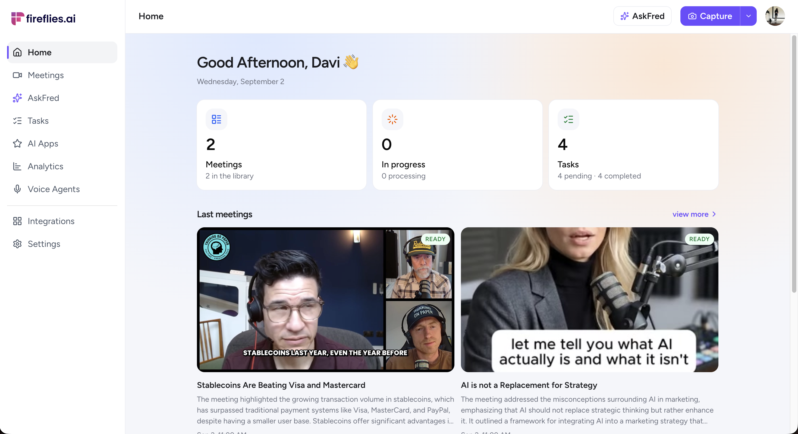
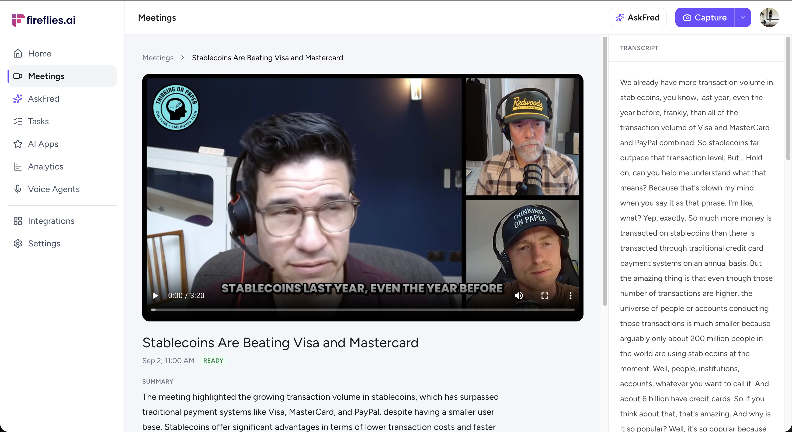
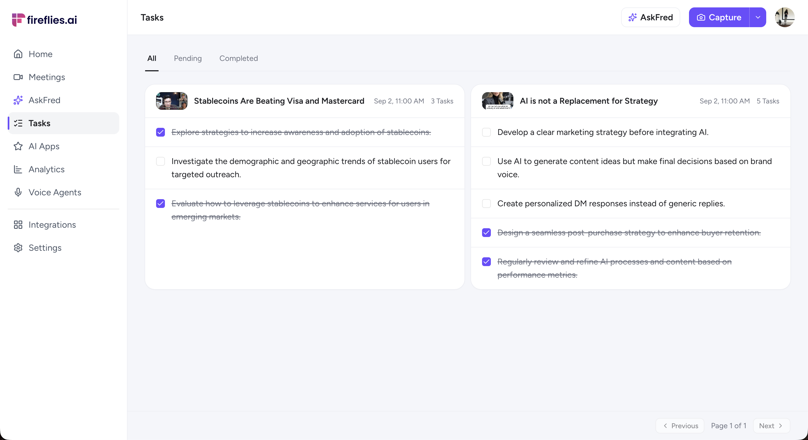
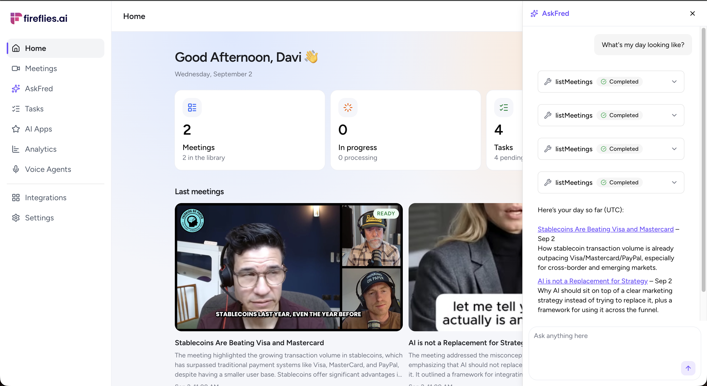

# Fireflies Frontend

This is a [Next.js](https://nextjs.org) app on [Bun](https://bun.sh). I chose Next.js because it lets us use server-side rendering and server components, while also giving us a natural place to put the backend-for-frontend (BFF).

[Clerk](https://clerk.com) handles authentication. The frontend uses Clerk's server APIs to get the current user and session token. The browser talks to Next.js, not to Hono.

## Screens

The home screen shows the meeting library, processing count, and tasks:



Meeting detail includes the video player, summary, and transcript:



Tasks are grouped by meeting so they can be checked off in place:



AskFred can search the user's meetings and transcripts through tools:



## Architecture

The frontend is a BFF for the Hono API. This matters because the backend runs behind a VPS and should not be public. Next.js routes proxy uploads, meeting reads, transcripts, media, tasks, and AskFred requests to the private API. They add the Clerk bearer token, validate inputs, and transform backend data into the shape the UI uses.

Next.js server components fetch the initial page data on the server. For example, the home page loads the current user, meetings, and recent tasks before rendering. Client components take over for interactive lists, task updates, upload progress, and AskFred streaming.

The app also uses the React `Suspense` API around the authenticated application frame. That lets the shell render a stable fallback while route-dependent content resolves.

Navigation links use Next.js prefetching on hover. This keeps the initial page lighter while still preparing a route when the user is likely to open it.

## UI

I use [shadcn/ui](https://ui.shadcn.com) because its components live in the application. That lets us customize the design instead of treating the UI kit as a fixed black box. Clerk uses the same shadcn theme.

AskFred uses [AI Elements](https://ai-sdk.dev/elements), a library of UI elements for AI applications. It provides the conversation, message, tool, suggestion, shimmer, and prompt input pieces used by the assistant.

## Screen recording

I could not find a screen-recording library that matched our needs, so I built this part ourselves with browser APIs. `getDisplayMedia` captures the user's window or entire screen, and `getUserMedia` captures the microphone.

When both sources provide audio, the implementation combines their tracks with the Web Audio API. It sends the computer audio and microphone audio into one `AudioContext`, creates a single destination stream, and combines that audio track with the display video track. `MediaRecorder` then records the result as a WebM file. If microphone or computer audio is unavailable, the recorder keeps the sources that are available.

The capture modal checks microphone, window, and entire-screen support before recording. Browser and device support is not uniform. Some phones, tablets, browsers, and operating systems do not support all screen or system-audio features. The modal links to the [browser compatibility table for `getDisplayMedia`](https://developer.mozilla.org/en-US/docs/Web/API/MediaDevices/getDisplayMedia#browser_compatibility). On macOS, capturing computer audio also depends on the selected surface and system permissions.

The display and microphone streams are requested separately:

```ts
const display = await navigator.mediaDevices.getDisplayMedia({
  video: { frameRate: { ideal: 30 } },
  audio: { suppressLocalAudioPlayback: false },
  systemAudio: "include",
});

const mic = await navigator.mediaDevices.getUserMedia({
  audio: { echoCancellation: false, noiseSuppression: false },
});
```

When both streams have audio, the Web Audio API mixes them into one track:

```ts
const context = new AudioContext({ latencyHint: "interactive" });
const destination = context.createMediaStreamDestination();

context.createMediaStreamSource(display).connect(destination);
context.createMediaStreamSource(mic).connect(destination);

const stream = new MediaStream([
  ...display.getVideoTracks(),
  ...destination.stream.getAudioTracks(),
]);
const recorder = new MediaRecorder(stream, { mimeType: "video/webm" });
```

## Data fetching

[TanStack Query](https://tanstack.com/query/latest) manages client-side server state. It gives us query keys, caching, stale times, and refetching without writing the same fetch logic in every component. Meeting lists poll every two seconds while a meeting is queued or processing, then stop polling when the work is done. Queued and processing meetings show summary and task skeletons instead of empty copy. Longer recordings can stay processing for a while. That wait is OpenAI transcription, not the UI.

The query client uses a one-minute stale time. Pages pass their server-loaded data into the client components, while TanStack Query reuses cached results for later renders and requests.

## Run

You need [Bun](https://bun.sh) and a running backend. The backend setup is in the [parent README](https://github.com/d4vz/fireflies-tech-challenge) and the [backend README](https://github.com/d4vz/fireflies-tech-challenge-backend).

Copy the environment template and add the Clerk keys:

```
cp .env.example .env.local
```

`API_URL` should stay `http://localhost:3000` when the backend Compose stack is running. Next.js calls that URL from the server. The browser calls the Next.js `/api/*` routes.

### Development

Development mode includes Next.js live reload:

```
bun install
bun run dev
```

Open `http://localhost:8080`. Clerk's development handshake hangs on `127.0.0.1`, so use `localhost`.

### Production

Build and start the production server:

```
bun install
bun run build
bun run start
```

The production server also listens on `http://localhost:8080`.
